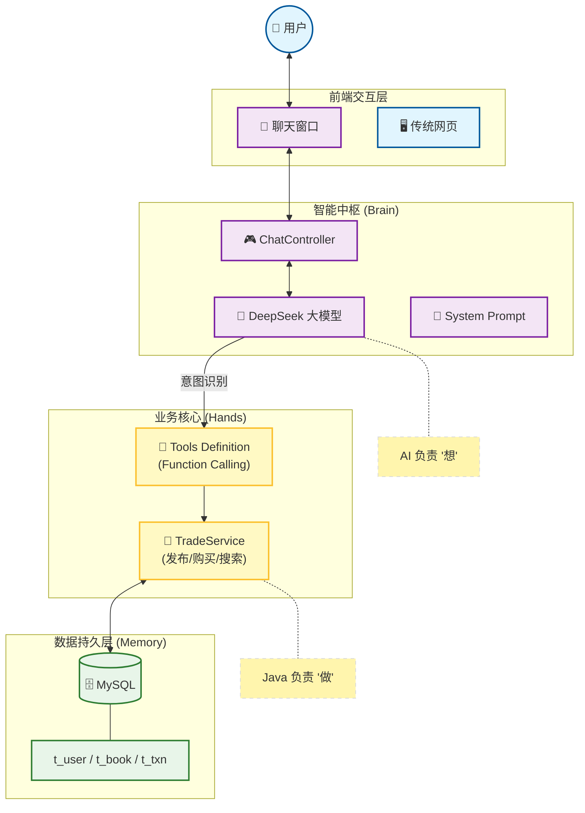

# 第 6 章导读：综合项目——SmartBook 智能图书交易系统

### 🏗️ 课程终极目标：从“写代码”到“做产品”

恭喜你！经过前 5 章的洗礼，你已经掌握了 Spring Boot、MyBatis、RESTful API 以及最前沿的 Spring AI 开发技能。

但只会写零散的接口是不够的。在这一章，我们将不再是单纯的“程序员”，而是要身兼数职——**产品经理**、**架构师**、**全栈工程师**，从零开始打造一个完整的**C2C 二手图书交易平台**。

更重要的是，我们将把这个传统电商系统升级为 **Agent-Driven（智能体驱动）** 的新一代应用，让 AI 真正接管业务逻辑。

---

### 📊 系统架构全景图

为了让你看清我们将要构建什么，我为你绘制了这张 **SmartBook 双模驱动架构图**。

---

### 📂 章节内容规划

本章将模拟真实的企业开发流程，分为三个阶段：

#### **第一阶段：设计与建模 (Architect)**

* **[01. 需求分析与建模 (Visual Modeling)](01-design.md)**
* **核心任务**: 画图。不写一行代码，先想清楚业务。
* **产出**: 用例图 (Use Case)、泳道图 (Activity Diagram)、ER 关系图 (ERD)。
* **数据库**: 设计用户、图书、订单三张表，并完成 SQL 初始化。

#### **第二阶段：核心业务开发 (Developer)**

* **[02. 核心业务开发 (AI 辅助编码)](02-implementation.md)**
* **核心任务**: 编写 `TradeService`。
* **难点**:
    * **事务控制**: 保证“扣钱”和“下架”同生共死 (`@Transactional`)。
    * **逻辑闭环**: 如何处理“余额不足”、“图书已售出”等异常情况。
* **工具**: 使用 MyBatisX 生成代码，使用 JUnit 5 进行单元测试。

#### **第三阶段：AI 赋能 (AI Engineer)**

* **[03. 智能体集成：Tool Calling 实战](https://www.google.com/search?q=03-agent-integration.md)**
* **核心任务**: 让 AI 学会调用 `TradeService`。
* **技术点**:
    * **JSON Schema**: 把 Java 方法描述给 AI 听。
    * **ChatController**: 编写中转逻辑，实现 "Chat to Action"。
* **效果**: 用户说“我要买那本 Java 编程思想”，系统自动完成下单。

---

### 🎓 综合项目

* **[实验 6：综合项目——SmartBook 完整实现](https://www.google.com/search?q=lab6.md)**
* **要求**:
    1. 跑通上述所有流程。
    2. 提交一份包含**架构图**、**测试报告**、**演示视频**的完整项目文档。

* **挑战**: 这是一个综合性极强的实验，是对你本学期所学知识（Spring Boot + MyBatis + 事务 + AI）的终极考核。

---

### 💡 学习建议

1. **不要跳过设计**：第 01 节画图看似枯燥，却是区分“码农”和“工程师”的分水岭。请务必亲手画一遍。
2. **事务是底线**：在写 `buyBook` 方法时，请时刻问自己：“如果这里断电了，我的钱会丢吗？”
3. **拥抱 AI**：在第 02 节，尝试让 AI 帮你生成 CRUD 代码和测试用例，体验“结对编程”的快感。

准备好了吗？让我们开始构建你的第一个 **AI Native** 电商系统！ 🚀
