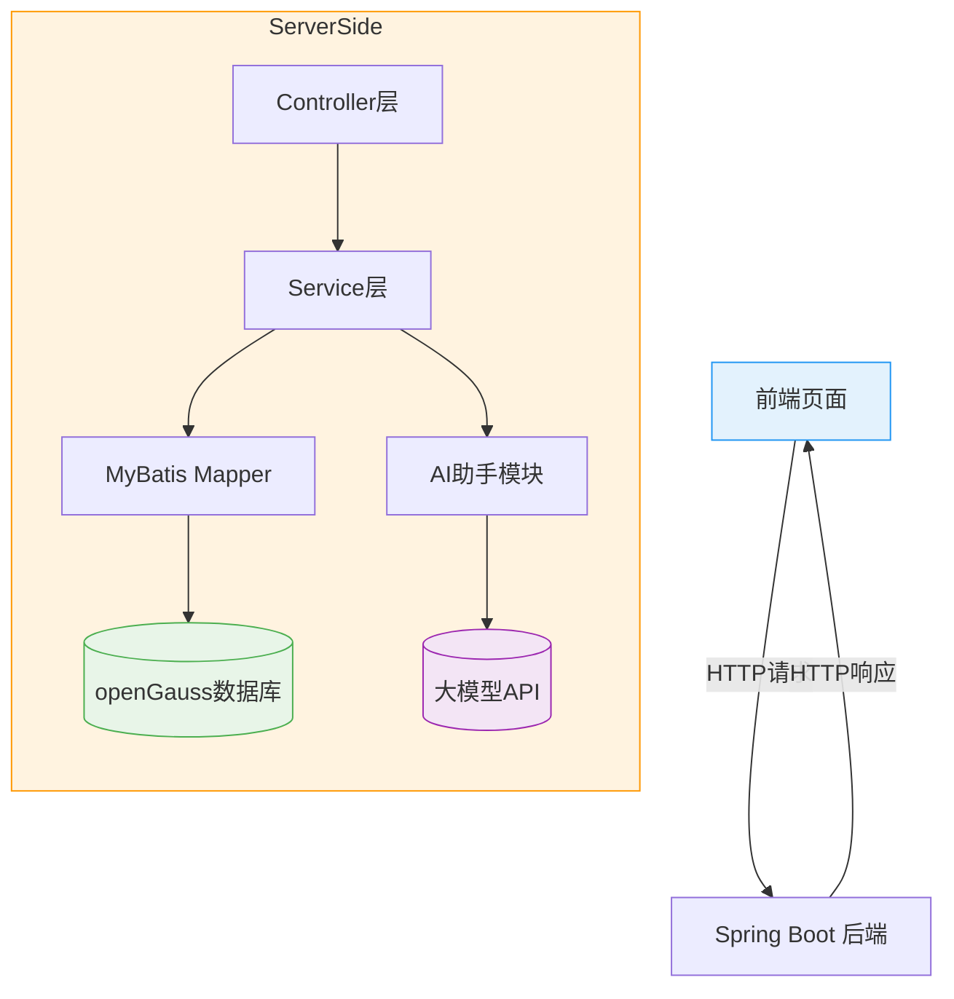

# 第6章 综合项目｜智能航班管理系统

!!! quote "本章金句"
    真正的技术能力不是记住多少API，而是能够将所学知识串联起来，解决实际业务问题。

## 📖 本章导读

恭喜你来到了课程的最后阶段！经过前五章的学习，你已经掌握了Java Web开发的核心技术栈：
- Spring Boot + MyBatis 开发框架
- openGauss 国产数据库
- AI 大模型集成能力

本章将通过一个完整的 **智能航班管理系统** 项目，把所有知识串联起来，让你体验从需求分析到系统部署的完整开发流程。

## 🎯 本章学习目标

通过本章学习，你需要达成以下目标：

- **📐 系统设计能力**：理解完整系统的架构设计和数据库建模
- **🛠️ 模块开发能力**：实现用户认证、航班管理等核心功能模块
- **🤖 AI 集成能力**：将 AI 助手功能融入业务系统
- **🚀 部署运维能力**：在信创环境下完成系统打包与部署

## 📑 章节内容

本章包含以下内容：

| 章节 | 内容 |
| --- | --- |
| 6.1 | [系统架构设计](architecture.md) |
| 6.2 | [用户模块实现](user.md) |
| 6.3 | [航班模块实现](flight.md) |
| 6.4 | [AI智能助手模块实现](ai.md) |
| 6.5 | [系统部署](deploy.md) |
| 6.6 | [实验6](lab6.md) |

## 🏗️ 系统架构设计

### 1. 系统概述

智能航班管理系统是一个集用户管理、航班查询预订和AI智能助手于一体的全栈Web应用，采用前后端分离架构。

### 2. 技术栈

| 层面 | 技术 | 说明 |
| --- | --- | --- |
| **后端框架** | Spring Boot | 快速开发框架，约定大于配置 |
| **持久层** | MyBatis + openGauss | 国产数据库，支持关系型数据存储 |
| **前端** | HTML + Vue.js + Axios | 轻量级前端框架，负责页面展示和交互 |
| **AI 集成** | DeepSeek API + MCP | 大模型接口调用，实现智能助手功能 |
| **部署环境** | 龙蜥 OS + Dragonwell JDK | 信创环境，国产操作系统和JDK |

### 3. 系统架构图



### 4. 数据库设计

#### 4.1 核心实体

系统包含以下核心实体：
- 用户(User)
- 航班(Flight)
- 订单(Order)
- 行程(Itinerary)

#### 4.2 实体关系图(E-R图)

```mermaid
erDiagram
    User ||--o{ Order : "创建" }
    Flight ||--o{ Order : "包含" }
    User ||--o{ Itinerary : "生成" }
    Order { 
        String orderId PK
        String userId FK
        String flightId FK
        Date createTime
        String status
    }
    User { 
        String userId PK
        String username
        String password
        String email
    }
    Flight { 
        String flightId PK
        String flightNumber
        String departure
        String destination
        Date departureTime
        Date arrivalTime
        int seatsAvailable
        double price
    }
    Itinerary { 
        String itineraryId PK
        String userId FK
        String destination
        String content
        Date createTime
    }
```

## 📦 核心模块实现

### 1. 用户模块

#### 1.1 功能需求
- 用户注册
- 用户登录
- 密码修改
- 用户信息管理

#### 1.2 关键技术
- Spring Security 认证授权
- JWT 令牌生成与验证
- 密码加密(BCrypt)

#### 1.3 代码示例

```java
// UserController.java
@RestController
@RequestMapping("/api/users")
public class UserController {
    
    @Autowired
    private UserService userService;
    
    @PostMapping("/login")
    public Result login(@RequestBody LoginRequest request) {
        // 登录逻辑实现
        User user = userService.login(request.getUsername(), request.getPassword());
        String token = JwtUtil.generateToken(user.getUserId());
        return Result.success("登录成功", Map.of("token", token, "user", user));
    }
    
    @PostMapping("/register")
    public Result register(@RequestBody RegisterRequest request) {
        // 注册逻辑实现
        userService.register(request);
        return Result.success("注册成功");
    }
}
```

### 2. 航班模块

#### 2.1 功能需求
- 航班查询
- 航班预订
- 订单管理
- 座位库存管理

#### 2.2 关键技术
- MyBatis 动态 SQL
- 事务管理
- 并发控制

#### 2.3 代码示例

```java
// FlightService.java
@Service
public class FlightService {
    
    @Autowired
    private FlightMapper flightMapper;
    
    @Autowired
    private OrderMapper orderMapper;
    
    @Transactional
    public Order bookFlight(String userId, String flightId) {
        // 检查航班是否存在
        Flight flight = flightMapper.selectById(flightId);
        if (flight == null) {
            throw new BusinessException("航班不存在");
        }
        
        // 检查座位是否充足
        if (flight.getSeatsAvailable() <= 0) {
            throw new BusinessException("航班已满");
        }
        
        // 创建订单
        Order order = new Order();
        order.setOrderId(UUID.randomUUID().toString());
        order.setUserId(userId);
        order.setFlightId(flightId);
        order.setCreateTime(new Date());
        order.setStatus("BOOKED");
        
        orderMapper.insert(order);
        
        // 更新航班座位数
        flightMapper.updateSeats(flightId, flight.getSeatsAvailable() - 1);
        
        return order;
    }
}
```

### 3. AI 智能助手模块

#### 3.1 功能需求
- 智能行程规划
- 航班推荐
- 旅行问答

#### 3.2 关键技术
- HTTP Client 调用大模型 API
- JSON 数据解析
- Prompt 工程

#### 3.3 代码示例

```java
// AIService.java
@Service
public class AIService {
    
    @Autowired
    private HttpClient httpClient;
    
    public Itinerary generateItinerary(String userId, String destination) {
        // 构建 Prompt
        String prompt = String.format("请为我规划一个前往%s的3天旅行行程，包含航班推荐、住宿建议和景点安排。", destination);
        
        // 调用大模型 API
        String response = aiClient.callDeepSeekAPI(prompt);
        
        // 解析结果
        String itineraryContent = parseAIResponse(response);
        
        // 保存行程
        Itinerary itinerary = new Itinerary();
        itinerary.setItineraryId(UUID.randomUUID().toString());
        itinerary.setUserId(userId);
        itinerary.setDestination(destination);
        itinerary.setContent(itineraryContent);
        itinerary.setCreateTime(new Date());
        
        itineraryMapper.insert(itinerary);
        
        return itinerary;
    }
}
```

## 📝 开发规范

### 1. 代码规范
- 遵循 Java 命名规范
- 使用 Lombok 简化代码
- 统一异常处理
- 添加必要的注释

### 2. 接口规范
- 采用 RESTful API 设计风格
- 统一返回格式
- 明确请求参数和响应数据结构

### 3. 安全规范
- 密码加密存储
- 接口访问权限控制
- SQL 注入防护
- XSS 攻击防护

## 🚀 系统部署

### 1. 打包构建

使用 Maven 进行项目打包：

```bash
# 清理并打包
mvn clean package -DskipTests
```

### 2. 部署环境准备

- 龙蜥 OS 服务器
- Dragonwell JDK 17
- openGauss 数据库
- Nginx (可选，用于前端部署)

### 3. 数据库初始化

```sql
-- 创建数据库
CREATE DATABASE flight_system;

-- 创建用户
CREATE USER flight_user WITH PASSWORD 'Flight@123';

-- 授权
GRANT ALL PRIVILEGES ON DATABASE flight_system TO flight_user;
```

### 4. 应用部署

```bash
# 上传 jar 包到服务器
scp target/flight-system.jar root@your-server:/opt/

# 启动应用
java -jar /opt/flight-system.jar --spring.profiles.active=prod
```

## 📊 项目验收标准

### 1. 功能验收
- ✅ 用户注册登录功能正常
- ✅ 航班查询功能正常
- ✅ 航班预订功能正常
- ✅ AI 智能助手功能正常
- ✅ 订单管理功能正常

### 2. 技术验收
- ✅ 代码结构清晰，符合规范
- ✅ 无明显性能问题
- ✅ 错误处理完善
- ✅ 数据库设计合理

### 3. 文档验收
- ✅ 项目README文档完整
- ✅ 接口文档清晰
- ✅ 部署文档详细
- ✅ 演示脚本完整

## 📚 扩展学习

- Spring Cloud 微服务架构
- Redis 缓存优化
- Docker 容器化部署
- CI/CD 持续集成

---

## 🎉 项目总结

通过本项目的开发，你已经完成了从一名Java Web初学者到全栈开发者的转变。你不仅掌握了核心的开发技术，还学会了如何将这些技术应用到实际项目中，解决真实的业务问题。

智能航班管理系统只是你Java Web开发之旅的起点，希望你能继续深入学习，不断提升自己的技术能力，成为一名优秀的全栈开发者！

[返回首页](../index.md){ .md-button }
