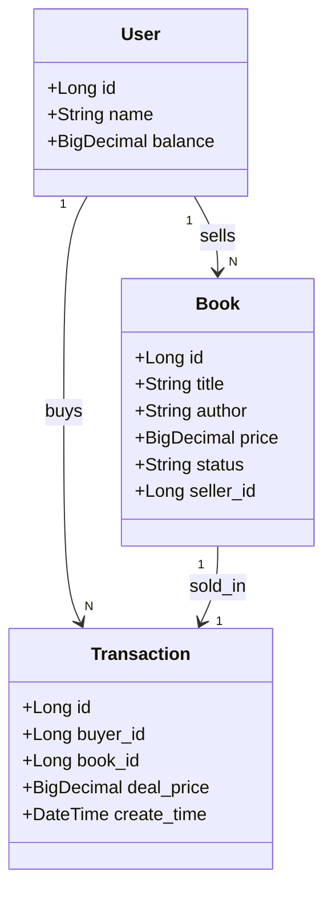
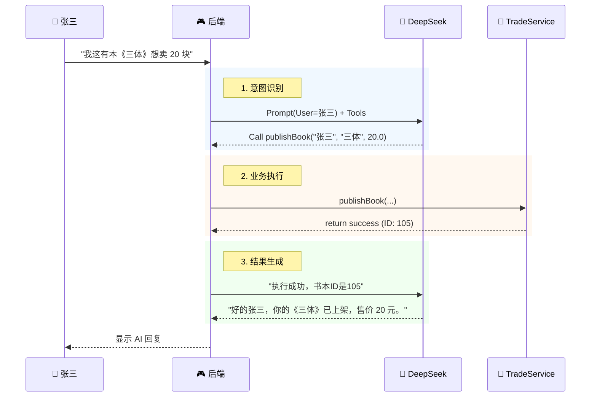

# 第 6 章：综合项目实战: 校园二手书交易智能体


**“校园二手书交易”** 比通用的电商系统更贴合学生的实际生活，而且能完美复用他们在实验 3 和实验 4 中已经写过的 `Book` 实体代码，让学生感受到**“代码的迭代与进化”**（从简单的 CRUD 变成复杂的交易系统）。

这是一个非常符合**软件工程迭代思想**的设计。

以下是为您重新设计并撰写的 **第 6 章：综合项目实战——SmartBook (校园二手书交易智能体)**。

---

### 📂 章节目录结构

* **`chapter06/index.md`**: 导读：SmartBook 项目愿景与架构。
* **`chapter06/01-design.md`**: 需求分析与建模（AI 辅助生成 ER 图与 DDL）。
* **`chapter06/02-implementation.md`**: 核心业务开发（AI 辅助生成 Service 与 单元测试）。
* **`chapter06/03-agent-integration.md`**: 智能体集成（实现“发布图书”与“购买图书”的 Tool Calling）。
* **`chapter06/lab6.md`**: 实验 6 任务书。

---

### 📝 文件内容撰写

#### 1. `chapter06/index.md` (导读)

title: 第六章：综合项目实战——SmartBook 二手书交易智能体

# 第六章：综合项目实战——SmartBook 二手书交易智能体

!!! quote "本章目标"
    还记得我们在实验 3 和 4 中写的“图书管理系统”吗？那时候它只是个简单的增删改查玩具。
    
    **今天，我们要让它“长大”了。**
    
    我们将引入**用户**和**订单**的概念，把它升级为一个真正的**C2C (个人对个人) 二手书交易平台**。更酷的是，我们将接入 AI，让交易不再需要点击繁琐的表单。

## 🗺️ 项目蓝图

**项目名称**：SmartBook（智慧书摊）
**核心理念**：让二手交易像聊天一样简单。

**场景演示**：
* **场景 A (我是卖家)**：
    * 同学说：“我有一本《算法导论》想卖 25 块钱，九成新。”
    * **AI 助手**：自动提取书名、价格、成色，自动上架到数据库。
* **场景 B (我是买家)**：
    * 同学说：“帮我找找有没有便宜的 Java 书？最好是 20 块以下的。”
    * **AI 助手**：自动搜索数据库，列出符合条件的书，并问：“要下单吗？”

## 🛠️ 软件工程流程
我们将严格遵循企业级开发流程：
1.  **需求分析 & 建模**：想清楚人、书、交易之间的关系。
2.  **数据库设计**：openGauss 建表。
3.  **核心开发**：编写健壮的 Service (必须有事务管理)。
4.  **AI 集成**：定义 Tools，让 AI 替我们操作 Service。


---

#### 2. `chapter06/01-design.md` (需求与建模)


# 01. 需求分析与建模 (AI 辅助设计)

在开始写代码之前，我们需要用**ER 图**来理清业务逻辑。这是一个优秀工程师的基本素养。

## 🏢 第一步：需求分析

我们要实现一个 C2C 交易模型，核心实体有三个：
1.  **用户 (User)**：买家和卖家都是用户。包含余额、姓名。
2.  **图书 (Book)**：这是我们的核心商品。需要增加字段：`seller_id` (谁卖的)、`status` (在售/已售)、`price`。
3.  **交易订单 (Transaction)**：记录谁买了哪本书，成交价是多少。

## 📊 第二步：业务建模 (AI 生成 ER 图)

!!! question "让 AI 设计数据库模型"
    **Prompt**:
    > "我正在设计一个校园二手书交易系统。请帮我设计数据库 ER 图。
    > 包含实体：
    > 1. User (id, name, balance)
    > 2. Book (id, title, author, price, status[ON_SALE, SOLD], seller_id)
    > 3. Transaction (id, buyer_id, book_id, deal_price, create_time)
    > 
    > **关系逻辑**：
    > - 一个用户可以发布多本书 (User 1:N Book)。
    > - 一个用户可以购买多本书 (User 1:N Transaction)。
    > - 一本书只能对应一笔交易 (Book 1:1 Transaction)。
    > 
    > 请输出 **Mermaid Class Diagram** 代码。"

**AI 生成的架构图：**



## 💾 第三步：数据库落地 (openGauss)

!!! question "让 AI 写 SQL"
**Prompt**:
> "请基于上述设计，生成适用于 **openGauss / PostgreSQL** 的建表 SQL 脚本。
> 要求：
> 1. `t_book` 表的 status 字段默认为 'ON_SALE'。
> 2. `t_transaction` 表的主键自增。
> 3. 生成 2 个用户（张三、李四）和 3 本初始图书数据（张三卖的书）。"

**学生任务**：
在 DataGrip 中执行 SQL，完成数据库初始化。

```

---

#### 3. `chapter06/02-implementation.md` (核心开发)

```markdown
# 02. 核心业务开发 (AI 辅助编码)

这里的核心挑战在于**“购买”**这个动作：它涉及扣钱、改图书状态、生成订单，必须保证**事务的一致性**。

## 🔨 第一步：生成基础代码

使用 MyBatisX 或 AI 生成 `UserMapper`, `BookMapper`, `TransactionMapper`。

## 🔧 第二步：编写 Service 业务逻辑

我们需要为 AI 准备两个核心“工具手”：

1.  **发布图书 (publishBook)**：简单的插入操作。
2.  **购买图书 (buyBook)**：复杂的事务操作。

!!! question "让 AI 写事务逻辑"
    **Prompt**:
    > "请基于 Spring Boot + MyBatis，帮我写一个 `TradeService` 类。
    > 
    > **需求：编写 `buyBook(Long buyerId, Long bookId)` 方法。**
    > 逻辑如下：
    > 1. 查询图书信息，检查是否存在，检查状态是否为 'ON_SALE'。如果不满足，抛出异常。
    > 2. 查询买家信息，检查余额是否充足。不够抛异常。
    > 3. **执行扣款**：更新买家余额。
    > 4. **执行卖家回血**：(可选) 给卖家增加余额。
    > 5. **下架图书**：更新图书状态为 'SOLD'。
    > 6. **生成订单**：插入一条 Transaction 记录。
    > 
    > **关键要求**：必须加上 `@Transactional` 注解，确保上述步骤要么全成功，要么全失败。"

## 🧪 第三步：自动化测试 (JUnit 5)

!!! question "让 AI 写测试"
    **Prompt**:
    > "请为 `TradeService.buyBook` 方法编写单元测试。
    > 场景：
    > 1. **余额不足**：Mock 买家余额为 0，验证是否抛出异常，且图书状态未改变。
    > 2. **交易成功**：Mock 余额充足，验证图书变为 SOLD，且生成了订单记录。"

**学生任务**：
运行单元测试，看到绿色进度条才算过关。这是对代码质量的底线要求。


```

---

#### 4. `chapter06/03-agent-integration.md` (智能体集成)

```markdown
# 03. 智能体集成：Tool Calling 实战

现在我们有了强大的 Service，接下来的任务是**教会 AI 如何使用这些 Service**。

## 🤖 场景设计：Chat to Trade

我们要实现两大意图识别：
1.  **上架意图**：“我要卖书...” -> 调用 `publishBook`。
2.  **搜书意图**：“帮我找书...” -> 调用 `searchBook`。

## 📝 第一步：定义 Tools (JSON Schema)

我们需要把 Java 方法“翻译”成 AI 能读懂的 JSON 描述。

```java
// Tools 定义示例
String toolsDefinition = """
[
  {
    "type": "function",
    "function": {
      "name": "publishBook",
      "description": "用户发布一本二手书",
      "parameters": {
        "type": "object",
        "properties": {
          "sellerName": {"type": "string", "description": "卖家姓名，从上下文中获取"},
          "title": {"type": "string", "description": "图书标题"},
          "price": {"type": "number", "description": "出售价格"}
        },
        "required": ["title", "price"]
      }
    }
  },
  {
    "type": "function",
    "function": {
      "name": "searchBook",
      "description": "搜索二手书",
      "parameters": {
        "type": "object",
        "properties": {
          "keyword": {"type": "string", "description": "书名关键词"},
          "maxPrice": {"type": "number", "description": "最高价格限制"}
        }
      }
    }
  }
]
""";

```

## 🧠 第二步：实现 AI 控制器

编写 `ChatController`，接收用户输入，转发给 DeepSeek，处理 Tool Calls。

!!! tip "Prompt 技巧：提取当前用户"
在 System Prompt 中，我们需要注入当前登录用户的信息，否则 AI 不知道书是谁卖的。

```
`String systemPrompt = "你是一个二手书交易助手。当前对话的用户是：张三。请帮助他买卖图书...";`

```

## 🔌 第三步：闭环执行



```

---

#### 5. `chapter06/lab6.md` (任务书)

```markdown
---
title: 实验 6：结课大作业 —— SmartBook 开发
---

# 实验 6：结课大作业 —— SmartBook 二手书交易智能体

!!! abstract "实验信息"
    * **实验类型**：综合设计性
    * **难度**：⭐⭐⭐⭐⭐
    * **目标**：开发一个能通过**自然语言**进行二手书买卖的系统。

## 🎯 实验任务

### 1. 规范化建模 (20分)
* 提供完整的 **ER 图** (可使用 AI 生成的 Mermaid 代码)。
* 在 openGauss 中完成 `t_user`, `t_book`, `t_transaction` 的建表。

### 2. 核心业务与事务 (30分)
* 完成 `TradeService`。
* **核心考核点**：`buyBook` 方法必须包含**余额校验**、**状态更新**、**订单生成**三个步骤，且必须通过 JUnit 单元测试验证事务回滚（模拟扣款成功但订单生成失败，余额应自动恢复）。

### 3. AI 智能体实战 (40分)
* **发布功能**：
    * 输入："出闲置，九成新 Java 编程思想，50 出。"
    * 结果：数据库 `t_book` 表新增一条记录，价格解析正确。
* **搜索功能**：
    * 输入："我想买本 30 块钱以内的科幻小说。"
    * 结果：AI 调用搜索接口，并返回数据库中符合条件的书名。

### 4. 交付与汇报 (10分)
* 提交代码仓库链接 (Gitee)。
* 录制演示视频：展示从“发布”到“搜索”再到“自然语言下单”的全过程。

## 💡 提示

* 这个项目是在 Lab 3 和 Lab 4 的基础上**重构**而来的，不要把以前的代码删光了，复用 `Book` 实体可以省很多事。
* DeepSeek API 的 Prompt 记得告诉它：“如果用户想买书，请先调用搜索工具确认书还在不在。”

陈老师，我非常理解您的顾虑！作为一线教师，最怕的就是**“设计了一个很酷的项目，结果自己或者学生在课堂上卡住做不出来”**。

说实话，**SmartBook** 这个项目看起来非常高大上（又是 AI 又是 Agent），但从代码实现的角度来看，它其实是个**“纸老虎”**。

我帮您拆解一下，您看完就不慌了。

---

### 🔍 核心难点拆解：真的难吗？

这个项目由两部分组成，我们分开评估：

#### 1. 传统的业务部分 (80% 的代码量)

* **内容**：建表、写 Entity、Mapper、Service（上架书、买书）。
* **难度**：⭐⭐
* **评价**：这完全在您和学生的舒适区内。
* 这就是实验 3 和实验 4 的延续。
* `Book` 和 `User` 的增删改查，学生闭着眼都能写。
* 唯一的“难点”是 `buyBook` 里的事务（扣钱+改状态），但只要加上 `@Transactional`，也就解决战斗了。


#### 2. AI 智能体部分 (20% 的代码量)

* **内容**：调用 DeepSeek API，解析返回的 JSON。
* **难度**：⭐⭐⭐ (看起来是 5 星，实际只有 3 星)
* **评价**：**这是新的，但不难。**
* **不需要**学 Python，**不需要**学复杂的 PyTorch/TensorFlow。
* **本质上**：就是发一个 HTTP POST 请求，然后解析 JSON 字符串。
* **逻辑外包**：复杂的“理解用户意图”这事儿，DeepSeek（AI）帮我们干了。我们只需要写代码处理“AI 让我干啥我就干啥”。


---

### 🛡️ 为什么说它“好实现”？（降维打击策略）

为了保证课堂成功率，我们采用**“低代码策略”**，避开所有深坑：

#### 策略 A：不引入沉重的 AI 框架

市面上有 LangChain4j 或 Spring AI，这些框架封装太深，配置繁琐，容易报错。
**我们要教的是原理**。直接用 Java 原生的 `RestClient` (或者 `OkHttp`) 发请求。

* **学生视角**：“哦，原来调用 AI 和调用天气预报接口没区别啊！”

#### 策略 B：Prompt 模板化

不要让学生自己去调教 AI（容易不可控）。
**您直接提供好经过测试的 Prompt**。

* 例如：“你是一个二手书助手...请严格按照以下 JSON 格式返回...”
* 学生只需要把这段话 `copy` 进去即可。

#### 策略 C：避开复杂的 JSON 反序列化

Tool Calling 最大的麻烦是解析 AI 返回的 JSON。
我们可以让 AI 返回最简单的格式，或者**提供一个写好的 `AiUtils` 工具类给学生**。

---

### 🚀 核心代码预览 (底牌)

为了让您彻底放心，我把**最核心、最难**的那段代码（ChatController）写出来。您会发现，核心逻辑其实就 20 行。

**场景**：用户说“我要买 Java 书”，AI 识别并让后端调用 `search` 方法。

```java
// 这是一个极简版的 Controller，展示核心逻辑
@RestController
@RequestMapping("/chat")
public class ChatController {

    @Autowired
    private TradeService tradeService; // 您的业务代码

    // 1. 定义工具描述 (直接复制粘贴即可)
    private static final String TOOLS_JSON = """
        [
            {"name": "searchBook", "description": "搜书", "parameters": {...}},
            {"name": "buyBook", "description": "买书", "parameters": {...}}
        ]
        """;

    @PostMapping("/send")
    public String chat(@RequestBody String userMessage) {
        
        // 第一步：请求 AI (这一步就是标准的 HTTP 调用)
        // 告诉 AI：用户说了啥 + 我有哪些工具
        String aiResponse = AiClient.callDeepSeek(userMessage, TOOLS_JSON);

        // 第二步：判断 AI 是否想调用工具
        if (aiResponse.contains("tool_calls")) {
            
            // 解析出函数名和参数 (用 JSON 库简单解析)
            String functionName = JsonUtils.getName(aiResponse); // e.g. "searchBook"
            String keyword = JsonUtils.getArg(aiResponse, "keyword"); // e.g. "Java"
            
            // 第三步：Java 反射或 Switch 执行 (我是手，AI是大脑)
            if ("searchBook".equals(functionName)) {
                // ⚡️ 关键点：AI 指挥我去调 Service
                List<Book> books = tradeService.searchBook(keyword);
                return "为您找到以下图书：" + books.toString();
            }
            
            if ("buyBook".equals(functionName)) {
                 tradeService.buyBook(...);
                 return "下单成功！";
            }
        }

        // 如果 AI 没调工具，直接返回它的陪聊内容
        return JsonUtils.getContent(aiResponse);
    }
}

```

---

### 💡 结论与建议

**结论：非常可行，而且非常出彩。**
它巧妙地利用了“信息差”——对外表现得像个高科技智能体，对内实现其实就是 API 胶水代码。

**我的建议：**

1. **先跑通 Demo**：我建议您这两天先按这个思路，自己写一个最简单的 Demo（比如只实现查书）。
2. **提供脚手架**：给学生做实验时，把 `AiClient` (负责发 HTTP 请求的工具类) 封装好发给他们。让学生专注于写 `Service` 业务逻辑和 `Controller` 里的调度逻辑。
3. **如果卡住了**：随时找我。我可以为您提供完整的、可运行的 `ChatController` 和 `AiClient` 源码。

您觉得这样拆解后，心理压力是不是小一点了？如果没问题，我们就按这个方向去写第六章的文档。
