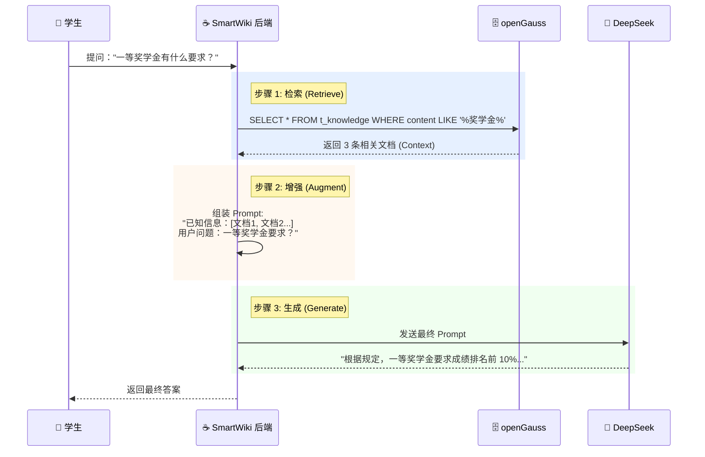

# 实验6：智能航班系统综合

### 📂 章节目录结构规划

#### **📖 第6章 导读**

* **文件**: `chapter06/index.md`
* **项目名称**: **SmartWiki —— 智能校园知识库**
* **核心理念**:
* 传统搜索：只能搜到包含关键词的文档，需要人自己去读。
* **AI 搜索 (RAG)**：系统先把相关文档找出来“喂”给 AI，AI 读完后直接回答用户的问题。


* **技术栈**: Spring Boot 3 + MyBatis + openGauss + PageHelper + DeepSeek API + SSE (Server-Sent Events，流式响应)。

#### **🏗️ 01. 需求分析与数据库设计**

* **文件**: `chapter06/01-design.md`
* **内容**:
* **业务场景**: 校园规章制度查询、课程问答助手。
* **表结构设计**:
* `t_knowledge`: 存储知识片段（title, content, category, create_time）。
* `t_log`: 记录用户的提问和 AI 的回答（用于审计）。


* **DDL 实战**: 在 openGauss 中建表。


#### **🧱 02. 后端核心：知识库 CRUD 开发**

* **文件**: `chapter06/02-core-crud.md`
* **内容**:
* **快速开发**: 既然学过 MyBatis 和 PageHelper，这里要求学生在 30 分钟内完成 `KnowledgeController` 的增删改查。
* **规范**: 严格遵守 `Result<T>` 统一响应和 GlobalException 全局异常。
* **重点**: 实现一个**高性能的全文模糊搜索**接口（为下一步给 AI 提供素材做准备）。


#### **🧠 03. 核心逻辑：手搓轻量级 RAG (检索增强生成)**

* **文件**: `chapter06/03-rag-impl.md`
* **难点**: 真正的向量数据库（Milvus）对初学者太重，我们用 **SQL Like** 模拟检索。
* **流程**:
1. **Retrieve (检索)**: 用户问“奖学金怎么评？”，Java 去数据库查 `title like '%奖学金%'`。
2. **Augment (增强)**: Java 把查到的 3 篇文章拼接到 Prompt 里：“这是相关资料...请根据资料回答”。
3. **Generate (生成)**: 调用 DeepSeek API 生成最终答案。


#### **🌊 04. 进阶体验：SSE 流式响应**

* **文件**: `chapter06/04-sse-stream.md`
* **痛点**: AI 回答需要 5-10 秒，前端如果一直转圈，体验很差。
* **技术**: **Server-Sent Events (SSE)**。
* **实现**:
* 将 Controller 的返回值从 `Result<String>` 改为 `SseEmitter`。
* 看着文字一个字一个字地蹦出来（打字机效果）。


#### **🚀 05. 部署与交付：Docker 容器化 (选修)**

* **文件**: `chapter06/05-deployment.md`
* **背景**: 陈老师您是 Home Lab 爱好者，这一节是为您和爱折腾的学生准备的。
* **内容**:
* 编写 `Dockerfile`。
* 编写 `docker-compose.yml` (编排 Java App + openGauss)。
* 一键启动整个系统。


#### **🧪 实验 6：结课大作业 —— SmartWiki 系统开发**

* **文件**: `chapter06/lab6.md`
* **要求**:
* 必须使用 openGauss 数据库。
* 必须包含 AI 问答功能。
* **加分项**: 实现 SSE 流式输出，或前端界面美观。


---

### 🎨 核心逻辑图解 (用于 03-rag-impl.md)



---

### 📝 实验 6 任务书摘要 (用于 lab6.md)

**任务背景**：
学校教务处的电话每天都被打爆，学生们总是在问重复的问题（比如“补考怎么报名”、“四六级什么时候查分”）。请你开发一个智能问答系统来解放教务老师。

**Prompt 模板设计 (Java 代码)**：

```java
String template = """
    你是一个智能校园助手。请根据下面的【已知信息】回答用户的【问题】。
    如果已知信息中没有答案，请诚实地回答“我不知道”，不要瞎编。
    
    【已知信息】：
    %s
    
    【问题】：
    %s
    """;
    
// 使用 Java 15 文本块格式化
String finalPrompt = String.format(template, contextString, userQuestion);

```

---

### 💡 为什么这样设计？

1. **闭环**：它把第 4 章的数据库查询和第 5 章的 AI 调用结合起来了。
2. **落地**：RAG（检索增强生成）是目前企业最主流的 AI 应用模式，学生写在简历里非常有含金量。
3. **可扩展**：基础好的学生可以把 SQL 搜索换成向量搜索，或者加上 Redis 缓存，上限很高。

您觉得这个最终项目的难度和方向合适吗？如果可以，我就按这个结构开始撰写。