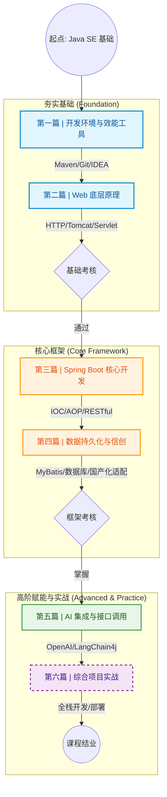

# Java Web 开发技术课程简介

欢迎来到《Java Web 开发技术》课程文档。

本课程旨在帮助具备 Java SE 基础的学员，系统地掌握现代企业级 Web 应用开发的核心技能。我们将从最底层的 Web 原理出发，逐步过渡到业界主流的 Spring Boot 生态体系，深入探讨数据持久化、信创环境适配，并紧跟时代潮流，融入 AI 大模型接口集成技术，最终通过一个综合性的实战项目将所有知识点融会贯通。

---

## 核心教学目标

通过本课程的学习，你将能够：

1.  **透视 Web 本质**：跳出框架看本质，深刻理解 HTTP 协议、Servlet 容器机制以及请求/响应生命周期。
2.  **掌握主流框架**：熟练使用 Spring Boot 3.x 进行高效的 RESTful API 开发，理解 IoC 和 AOP 核心思想。
3.  **驾驭数据交互**：掌握关系型数据库设计，熟练使用 JDBC、MyBatis 或 JPA 进行数据持久化操作。
4.  **适应国产化需求**：了解信创（信息技术应用创新）背景下的开发要求，掌握在国产操作系统和数据库环境下的部署与适配技能。
5.  **拥抱 AI 时代**：学会如何将 LLM（大语言模型）能力集成到传统的 Java Web 应用中，构建智能化的应用场景。
6.  **具备实战能力**：能够独立设计并完成一个功能完备、代码规范的企业级 Web 项目。

---

## 学习路线图 (Course Roadmap)

本课程分为六大篇章，循序渐进。以下是我们的学习路径规划：

---

## 核心技术栈

本课程采用目前企业开发中主流且前沿的技术组合：

| 分类 | 技术/工具 | 说明 |
| :--- | :--- | :--- |
| **开发语言** | Java 17 (LTS) 或 Java 21 (LTS) | 拥抱现代 Java 新特性 |
| **核心框架** | Spring Boot 3.x, Spring Framework 6.x | 业界标准微服务基石 |
| **Web 容器** | Apache Tomcat (内嵌) | 理解 Servlet 规范的标准实现 |
| **持久化层** | MySQL / PostgreSQL, MyBatis Plus / Spring Data JPA | 灵活高效的数据访问 |
| **构建/管理** | Maven / Gradle, Git | 标准化项目构建与版本控制 |
| **AI 集成** | OpenAI API / 国内大模型 API, LangChain4j (可选) | 探索 Java 应用的智能化路径 |
| **信创环境** | 国产操作系统(如麒麟/统信), 国产数据库(如达梦/人大金仓) | (选修模块) 适应特定行业需求 |

---

## 课前准备

在开始学习之前，你需要具备以下基础：

!!! abstract "必备前提"
    * 熟悉 **Java SE** 核心语法（变量、循环、面向对象编程、异常处理）。
    * 了解基本的 Java 集合框架（List, Map）。
    * 了解基础的 HTML/CSS/JS 知识（能看懂简单的前端页面）。

---

## 如何使用本文档

* **左侧导航**：我们已经切换为侧边栏导航模式。左侧的目录树清晰地展示了课程的章节结构，你可以点击章节标题展开或折叠内容。
* **搜索功能**：使用页面顶部的搜索框可以快速查找特定的知识点或 API。
* **代码实践**：文档中包含大量的代码示例，请务必动手在 IDE 中输入并运行这些代码，实践是掌握技术的唯一途径。

**现在，请点击左侧的“第一篇 | 开发环境与效能工具”，开启你的 Java Web 之旅！**